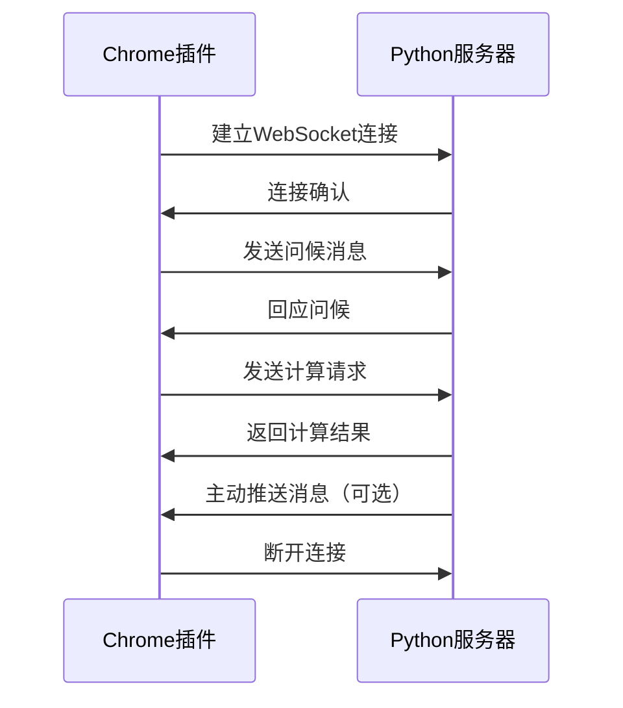

# Chrome插件与Python程序WebSocket通信示例

这个项目演示了如何使用WebSocket实现Chrome浏览器插件与本地Python程序之间的实时通信。

## 📁 项目结构

```
chrome_extension_communication/
├── websocket_server.py          # Python WebSocket服务端
├── requirements.txt             # Python依赖包
├── chrome_extension_communication/
│   ├── background.js           # Chrome插件后台脚本
│   ├── popup.html             # 插件弹出页面
│   ├── popup.js               # 弹出页面脚本
│   └── manifest.json          # 插件配置文件
└── README.md                   # 说明文档
```

## 🚀 快速开始

### 第一步：安装Python依赖

```bash
# 安装WebSocket库
pip install -r requirements.txt
```

### 第二步：启动Python服务器

```bash
# 运行WebSocket服务器
python3 websocket_server.py
```

服务器将在 `ws://localhost:8765` 启动并监听连接。

### 第三步：安装Chrome插件

1. 打开Chrome浏览器
2. 进入 `chrome://extensions/`
3. 开启右上角的"开发者模式"
4. 点击"加载已解压的扩展程序"
5. 选择 `chrome_extension_communication` 文件夹

### 第四步：测试通信

1. 点击浏览器工具栏中的插件图标
2. 在弹出的窗口中点击"连接服务器"
3. 连接成功后，可以进行各种测试：
   - 发送问候消息
   - 使用计算器功能
   - 发送自定义JSON消息

## 💡 功能特性

### WebSocket服务端功能
- ✅ **多客户端支持**：同时处理多个Chrome插件连接
- ✅ **消息类型处理**：支持问候、计算、自定义消息等
- ✅ **错误处理**：完善的异常处理和错误回应
- ✅ **实时通信**：支持服务端主动推送消息
- ✅ **日志记录**：详细的连接和消息日志

### Chrome插件功能
- ✅ **友好界面**：现代化的弹出式用户界面
- ✅ **连接管理**：可视化连接状态和控制
- ✅ **消息测试**：多种预设消息类型测试
- ✅ **自定义消息**：支持发送JSON格式的自定义消息
- ✅ **消息记录**：实时显示发送和接收的消息

## 🔧 技术详解

### 与Native Messaging的对比

| 特性 | WebSocket | Native Messaging |
|------|-----------|------------------|
| **配置复杂度** | 简单 | 复杂（需要注册表配置） |
| **跨平台支持** | 优秀 | 有限制 |
| **实时性** | 优秀（双向实时） | 一般（单向触发） |
| **调试便利性** | 优秀 | 困难 |
| **服务端主动推送** | 支持 | 不支持 |
| **多客户端连接** | 支持 | 不支持 |

### WebSocket通信流程



## 📝 消息格式规范

### 问候消息
```json
{
    "type": "greeting",
    "content": "你好，Python服务器！"
}
```

### 计算请求
```json
{
    "type": "calculation",
    "num1": 10,
    "num2": 5,
    "operation": "+"
}
```

### 服务器回应
```json
{
    "type": "calculation_result",
    "result": 15
}
```

### 错误消息
```json
{
    "type": "error",
    "message": "错误描述"
}
```

## 🛠️ 扩展开发

### 添加新的消息类型

1. **在Python服务端添加处理逻辑**：
```python
elif data.get('type') == 'your_new_type':
    # 处理新消息类型
    response = {
        'type': 'your_response_type',
        'data': 'your_response_data'
    }
```

2. **在Chrome插件中添加发送逻辑**：
```javascript
function sendNewMessage() {
    const message = {
        type: 'your_new_type',
        // 添加其他数据
    };
    sendMessage(message);
}
```

### 添加用户界面元素

在 `popup.html` 中添加新的HTML元素，并在 `popup.js` 中添加对应的事件处理逻辑。

## 🐛 常见问题

### Q: WebSocket连接失败
**A**: 确保Python服务器正在运行，并且端口8765没有被其他程序占用。

### Q: Chrome插件加载失败
**A**: 检查manifest.json文件格式是否正确，确保所有文件路径正确。

### Q: 消息发送失败
**A**: 确保WebSocket连接已建立，检查消息格式是否为有效JSON。

### Q: 如何修改端口号
**A**: 同时修改 `websocket_server.py` 中的端口配置和 `background.js` 中的 `WEBSOCKET_URL`。

## 📚 进阶学习

1. **WebSocket协议**：了解WebSocket的底层实现原理
2. **Chrome插件开发**：学习更多Chrome Extension API
3. **异步编程**：深入理解Python asyncio和JavaScript Promise
4. **网络安全**：了解WebSocket安全最佳实践

## 🤝 贡献

欢迎提交Issue和Pull Request来改进这个项目！

## �� 许可证

MIT License 